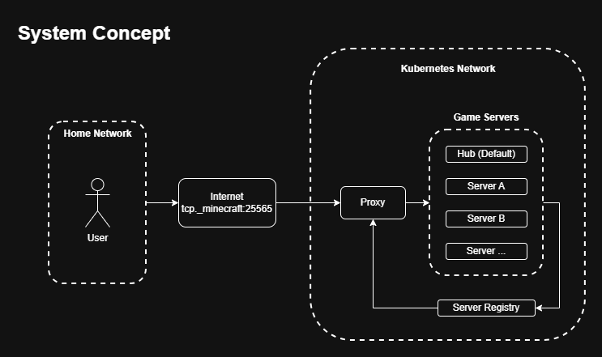

# Wayback Minecraft (Baseimage)

## Objective:
Connect Minecraft Servers together through a network allowing users to traverse archived servers.

## High level concept:

This repository is dedicated to the Game-Servers deployment under the Kubernetes Network.

## Implementation:

### Server Configuration:
The server will receive a world_key pointing and request the corresponding world for loading.

### Server Initialization:
Upon initialization, the server will send a post request to the [Server Registry Service]() containing its connection information.

### Worlds:
Minecraft worlds store the majority of data needed to run a server in a frozen state.

Worlds store:
- Chunk Data (Areas generated by players)
- PlayerData:
    - UUID
    - Username
    - First_Join
    - Last_Join
    - Location (x, y, z)
    - Inventory
    - Advancements

In order to save on compute, we will rip out all of Minecraft's bundled code and events, implementing only what we need. We can achieve this easily using [Minestom](https://minestom.net/).
